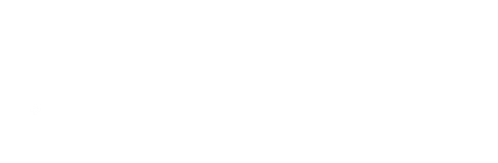
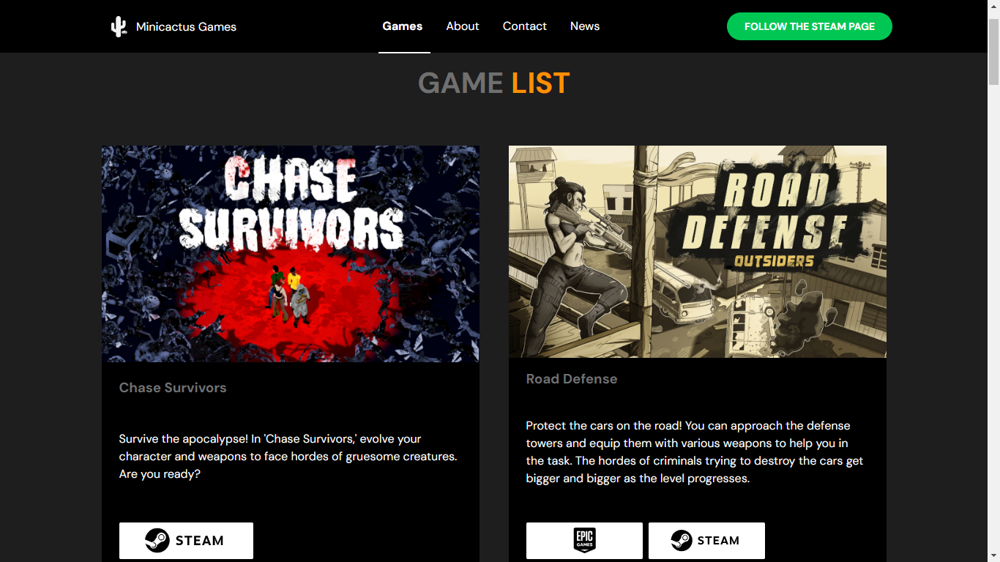

<h1 align="center" style="text-align: center;">
  
  Minicactus Games
</h1>

> Site da Minicactus Games, um estúdio brasileiro de jogos indie.

<h2>💻 Projeto</h2>

Este repositório contém a segunda versão do site da Minicactus Games, criada utilizando ReactJS. A versão inicial do projeto, desenvolvida com HTML, CSS e JavaScript, pode ser encontrada [aqui](https://github.com/madalena-rocha/minicactus-games).

[🔗 Site da Minicactus Games](https://www.minicactusgames.com/)

<h2>🛠️ Tecnologias</h2>

- ReactJS
- ReactDOM
- React Router DOM
- React Router Hash Link
- React Scroll
- Scroll Reveal
- UUID
- Phosphor Icons
- ViteJS

<h2>💜 Contato</h2>

 

